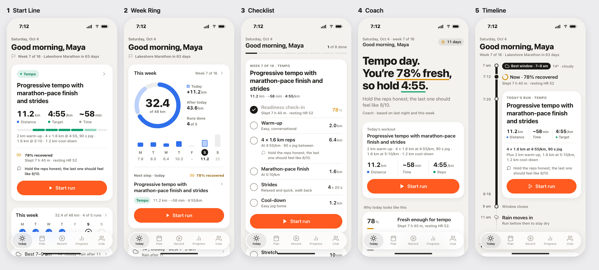
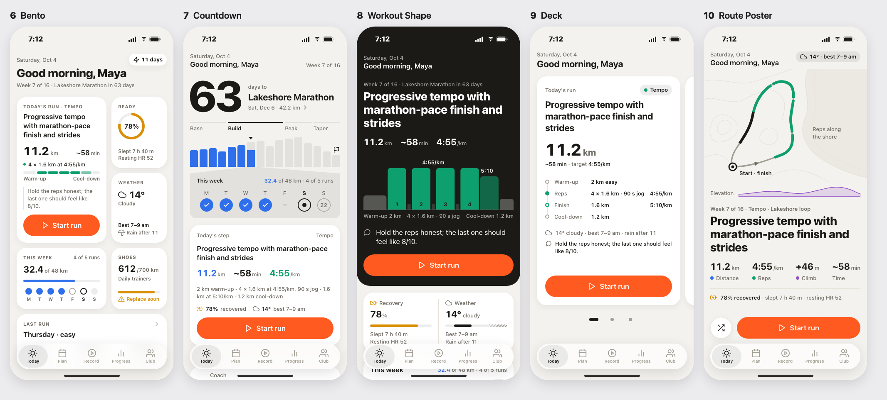

# Tenfold

**Ten real variations of any app screen, as phone mockups, in one message.**
A Claude Code skill (`design-studio`) for mobile UI design: it studies the screens around the one
you're changing, renders ten genuinely different directions on your app's own
tokens, opens them in a local gallery, tells you which one it would ship and
which one it thinks *you'll* pick, then turns your pick and your notes into ten
more. Repeat until you say build.




**[Open the live demo gallery →](https://adrianpartain59.github.io/tenfold/tempo/today/r1/)**
(a fictional running app, "Tempo". Click any phone to focus it, use ← → to step through, toggle dark mode.)

## Install

In Claude Code:

```
/plugin marketplace add adrianpartain59/tenfold
/plugin install tenfold@tenfold
```

Or copy the skill folder by hand:

```bash
git clone https://github.com/adrianpartain59/tenfold.git
cp -R tenfold/skills/design-studio ~/.claude/skills/design-studio
```

Requirements: Claude Code, macOS or Linux, `python3` (the gallery server),
and Google Chrome or Chromium if you want contact-sheet images. Node is only
needed for the optional React Native token export.

## Use it

Open Claude Code in your app's repo and ask for designs the way you'd ask a
designer (or run `/tenfold:design-studio <screen>`):

- "Redesign the settings screen"
- "Show me 10 options for the paywall, go bold"
- "Give me variations of the stats card on Home"

Each round:

1. **Context sweep.** Before drawing anything it maps the target screen's
   content, the screens around it, every tab root, and your design rules, so
   the ideas fit your app instead of looking pasted in.
2. **Ten ideas, not ten skins.** Every pair of variations differs on at least two
   real axes (hero, structure, density, interaction...). Colour or corner-radius
   swaps don't count. Wildcards are labelled and say what else in the app would
   have to change to match.
3. **A gallery on localhost.** `http://localhost:4545/<project>/<topic>/r1/`
   opens in your browser: every variation in a phone frame next to your current
   screen, light and dark, with notes on what changed and what it would take to build.
4. **Two picks.** Claude marks the one it would ship and predicts the one you'll
   choose, based on a taste log of your past picks that gets sharper every round.
5. **Iterate or build.** Pick one and type feedback, and round 2 is ten
   refinements of *that* design. Pick one with no changes and it writes a
   build spec and builds it in your codebase.

Old rounds stay put, so every link keeps working.

## Web mode

Redesigning a website instead of a screen? Ask for it the same way ("redesign
our marketing site", "10 directions for the landing page") or put
`surface: web` in your adapter. Web rounds run in stages:

1. **Directions:** ten full-length home pages, each with its own type, grid
   and art direction, shown in a desktop frame with the phone version beside
   it. Click one to scroll it, switch widths, or open it live.
2. **Converge:** refinements of the one you pick.
3. **System proof:** your pick applied to every page template, linked into a
   site you can click through, before anything gets built.

## Paywall mode

Designing a paywall? Ask for it the same way ("ten paywall ideas", "ten
testimonial paywalls", "redesign the exit offer") or put `surface: paywall`
in your adapter. It knows what converts (a cited playbook), works from a
catalog of paywall archetypes, and shows every variation in every state
(the other plan selected, exit offer, friend price).

1. **Concepts:** ten different archetypes: trial timeline, testimonial
   wall, personalised plan, and so on.
2. **Concept:** one archetype, done ten ways.
3. **A/B set:** your pick as a control plus variants that each change one
   thing, ready for an experiment.

Give it a `paywall-data` command in your adapter and it reads your live
paywall numbers before it designs. The command runs locally with your own
credentials.

## Teach it your app (optional)

Add `.design-studio/adapter.md` at your project root. The skill reads it
first and it overrides the defaults. Put in whatever a new designer on your
team would need:

- where your design-system docs and tokens live
- the command that exports your tokens (a React Native tokens module works
  out of the box: `node <skill>/scripts/export-tokens.mjs --root . --entry
  src/theme/index.ts --out <topic>/tokens.css`)
- your icon set, if you have an exporter for it (otherwise it uses Feather)
- standing rules ("one accent colour", "no em dashes in copy", "five tabs max")
- how an approved design should be built (branch, components, checks)

Without an adapter it works from your code and writes the tokens file by hand.

## Your data stays on your machine

Rounds live in `~/design-studio/`, and your taste log is
`~/design-studio/TASTE.md`. The skill itself sends nothing anywhere: rounds
are plain local files (Claude Code still talks to Claude as usual). The gallery server
only answers on `127.0.0.1`. To look at rounds on your phone over the same
Wi-Fi, start Claude Code with `DESIGN_STUDIO_BIND=0.0.0.0` (anyone on that
network can then open your mockups, so do it at home, not at a café).

| Variable | Default | What it does |
|---|---|---|
| `DESIGN_STUDIO_ROOT` | `~/design-studio` | where rounds and the taste log live |
| `DESIGN_STUDIO_PORT` | `4545` | gallery server port |
| `DESIGN_STUDIO_BIND` | `127.0.0.1` | `0.0.0.0` for phone viewing on your network |
| `DESIGN_STUDIO_NO_OPEN` | unset | set to stop rounds opening in your browser automatically |

## What's inside

```
skills/design-studio/
  SKILL.md                  the loop Claude follows
  references/               design principles + pre-send checklist, the context
                            sweep, how to get ten distinct variations, mockup
                            craft, the paywall playbook and archetypes
  scripts/studio.sh         round folders, gallery server, checks, icons, contact sheets
  scripts/export-tokens.mjs React Native tokens module → tokens.css
  assets/                   the gallery page, the paywall gallery and
                            paywall.css, and the phone-screen base CSS
docs/                       the live demo (GitHub Pages)
```

## Feedback

Issues with ideas, bugs and before/after screenshots are welcome. This is a
personal project, so I review pull requests but may not merge them. If you
want to take it somewhere different, fork it; the MIT license allows that.

## License

[MIT](LICENSE) © 2026 Adrian Partain. The demo uses [Feather icons](https://feathericons.com) (MIT).
